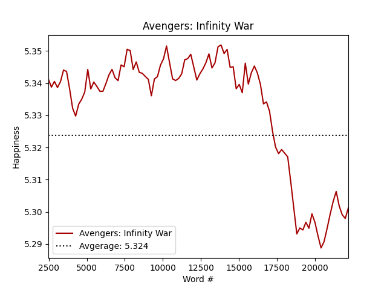
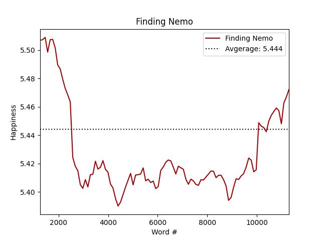
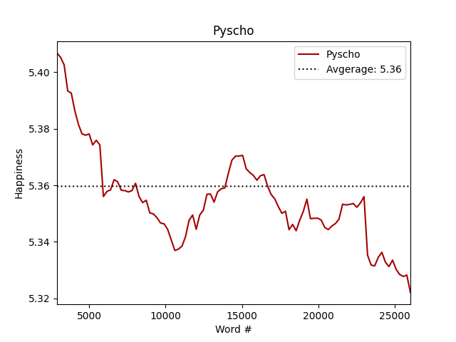
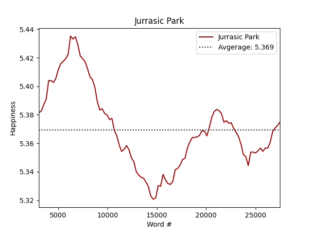
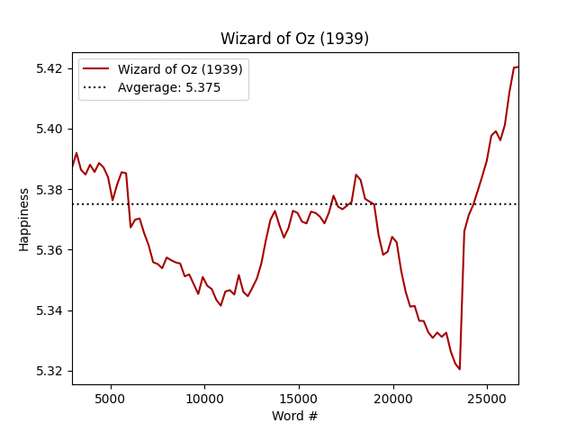
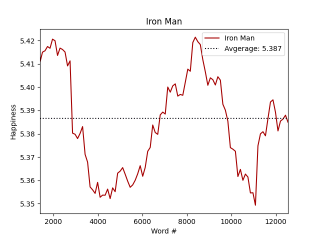

# Visualizing Story Telling Using Script Sentiment Analysis

This project takes a movie script and performs sentiment analysis on it to generate a graph that represents the plot of the movie.

If you would like to read the full paper, it can be found here: [link](Paper.pdf)

If you would like to see my presentation, it can be found here: [link](Presentation.pdf)

## Here are the 6 graphs I used to demonstarte this project

